
<h1 align="center">西安旅游管理系统+vue</h1>

## 简介
西安旅游管理系统：角色分为管理员、用户；功能包含景点信息管理、论坛互动管理、充值支付、用户留言管理、景点预定与评价，以及用户注册与登录。    --计算机毕业设计源码；毕设源码；java毕业设计源码

## 联系方式

<h3 align="center">获取完整代码与数据库文件 + 微信：deepguan QQ: 86050149 QQ群: 783742310</h3>

<h3 align="center">可帮忙远程部署 包运行成功！提供远程部署、修改代码、设计文档指导、代码讲解等服务！</h3>

## 功能介绍（完整见运行截图）
管理员： 管理员可以通过后台管理界面实现景点信息管理，包括添加、编辑、删除景点信息，查看和回复用户的景点留言及论坛帖子，管理用户评论和帖子回复。论坛管理功能允许管理员查看和操作论坛中的帖子及回复内容，提供便捷的管理工具。管理员还能执行用户管理功能，包括注册、登录、角色分配以及权限管理，确保系统的安全性和有效运作。

用户： 用户可以通过系统的前端界面浏览和搜索景点信息，查看详细的景点数据以及进行门票购买。系统提供用户注册和登录功能，支持角色选择，以个性化体验。用户可以在个人中心查看和修改个人信息，添加和回复景点留言，参与论坛讨论。此外，用户也可以通过评论窗口与其他用户互动，分享旅游体验，获取最新旅游资讯，并查看系统推荐的热门景点。

## 运行截图
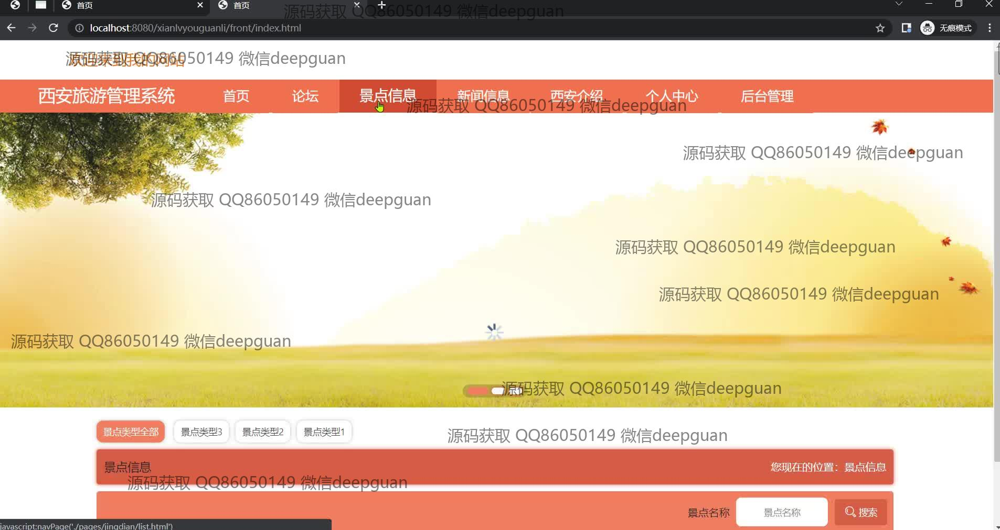
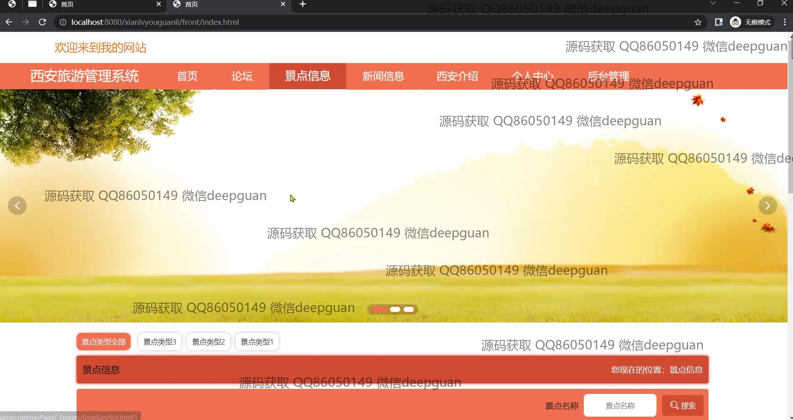
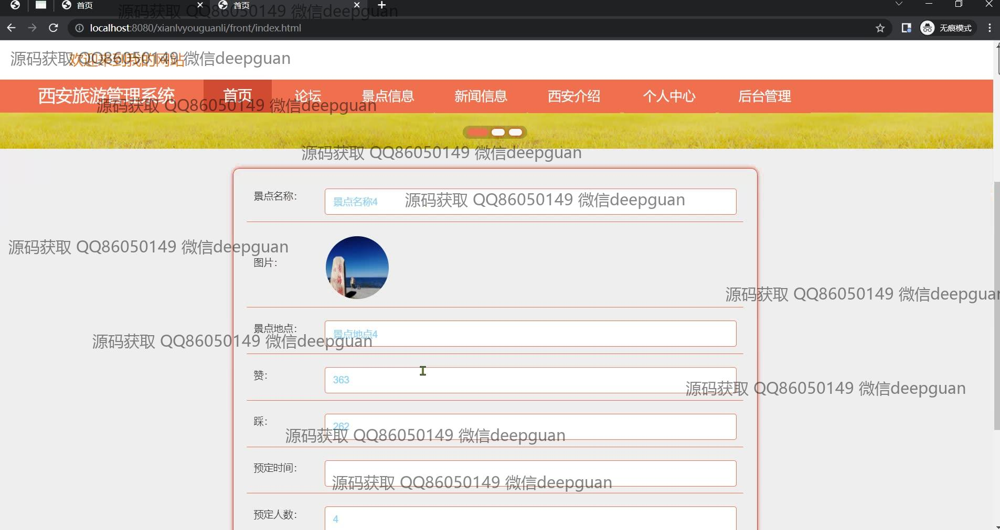
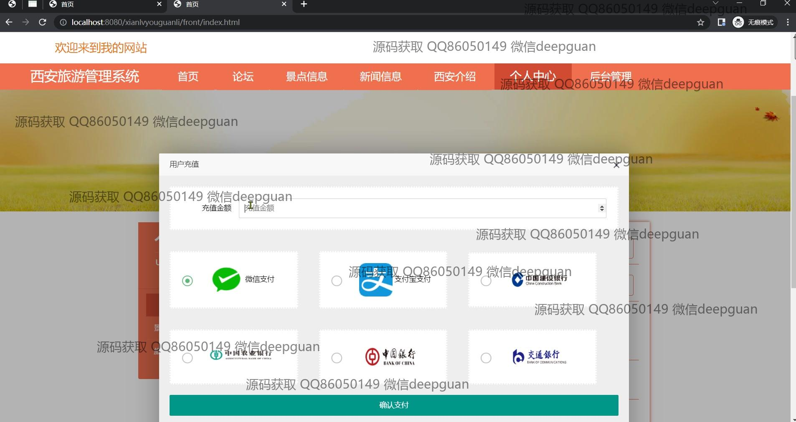

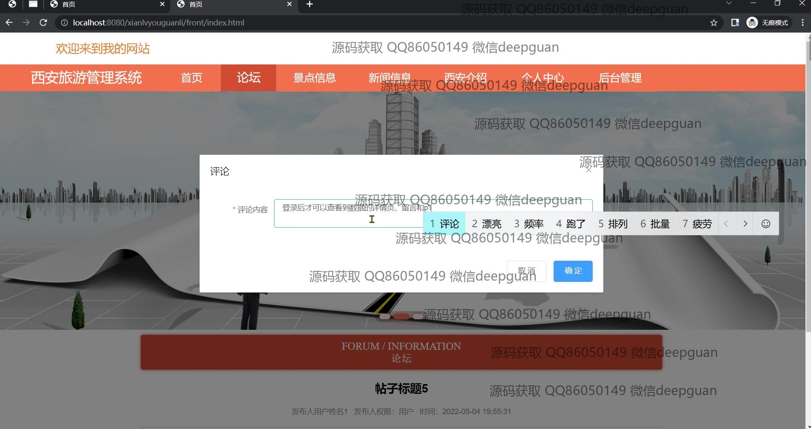
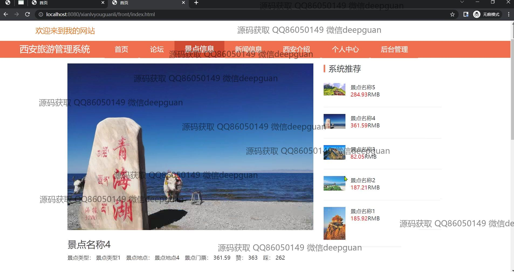
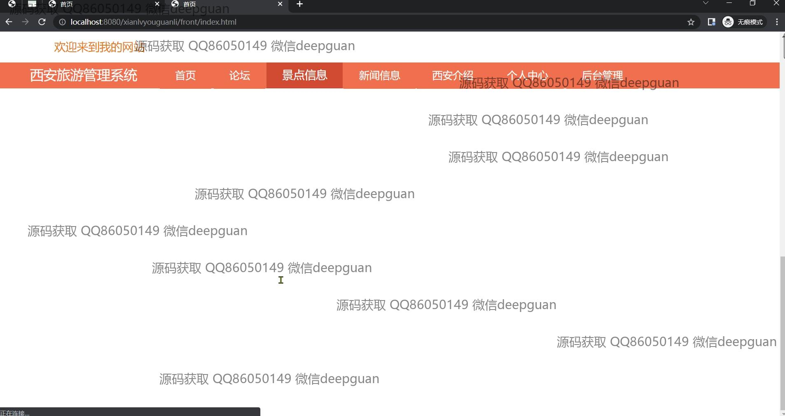
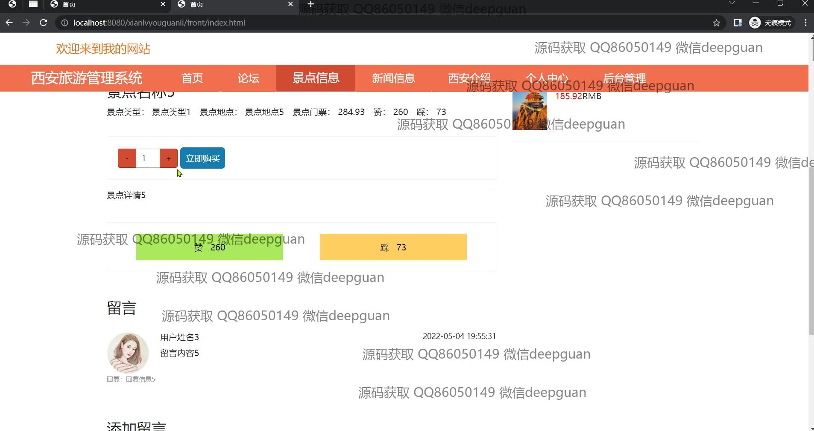
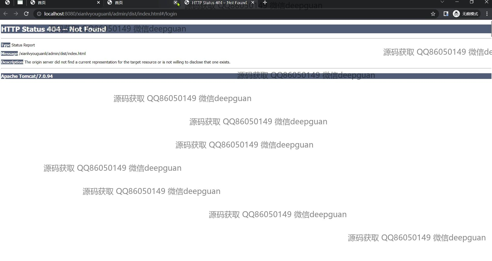
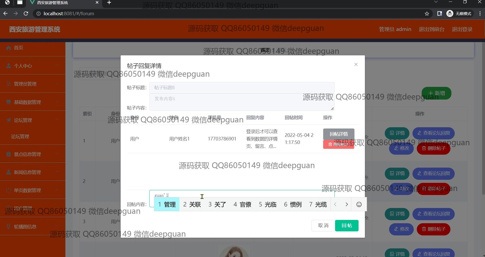
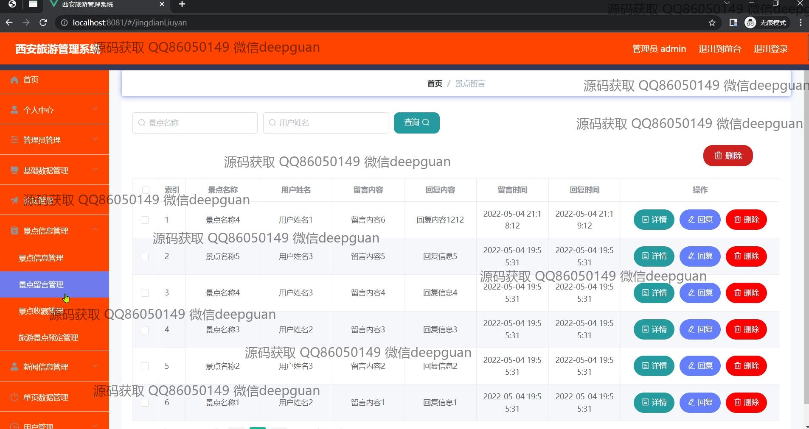
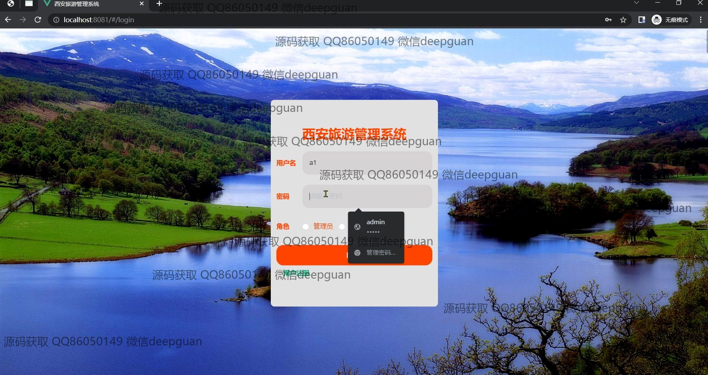
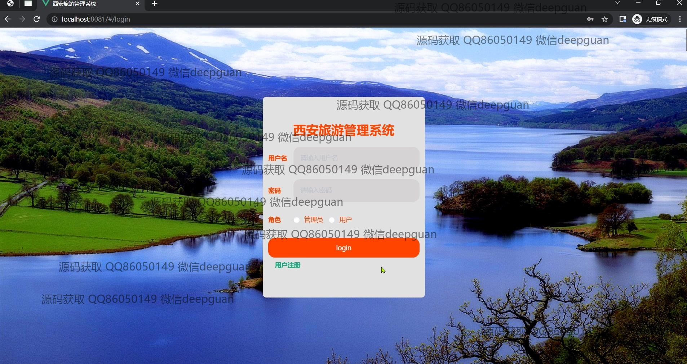

本代码来源于网络,仅供学习参考使用!

